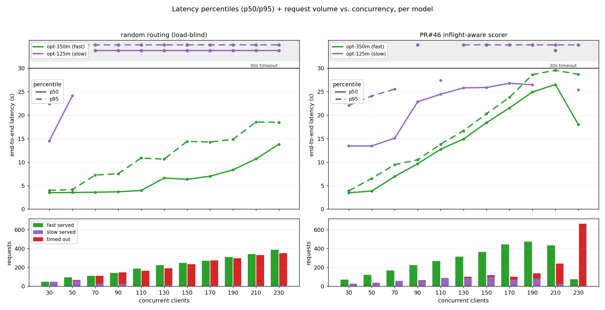
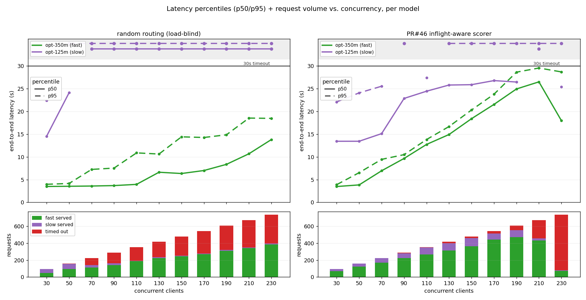
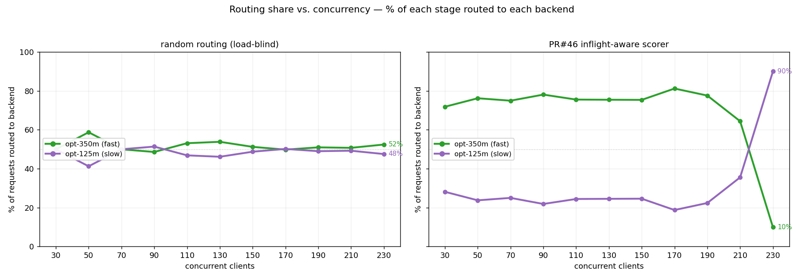

# Concurrency sweep 30→230 — random vs. PR #46 inflight-aware (Kind sims)

Fixed concurrent-client sweep at **30, 50, 70, …, 230** clients (11 stages, jumps of 20,
`num_requests = 4×concurrency` = 120…920, 15s idle cooldown between stages). Wider/higher
than the 30→120 sweep specifically to **push past the FAST sim's capacity too** and see the
system-wide ceiling — not just the slow sim drowning. The picker chooses between the fast
`opt-350m` (TTFT 1s / ITL 50ms) and slow `opt-125m` (TTFT 3s / ITL 200ms) sims, both
`--max-num-seqs=10`.

**Each stage is trimmed by 10% at both ends** (first/last 10% of requests by time order
dropped) to mitigate ramp-up / ramp-down outliers, so all stats below are over the steady
middle 80% of each stage (4576 of 5720 requests).

### Latency percentiles per model (timeouts counted)

Two stacked panels per arm: **top** = p50 (solid) / p95 (dashed) latency, green = fast,
purple = slow; a percentile dominated by timeouts leaves the main region at the 30s line and
reappears in the **separated TIMEOUT band** above the break. **Bottom** = request volume per
concurrency — green served-by-fast, purple served-by-slow, **red timed-out**.



Bottom-bar variants (same top panel): `--bars split` (above, one bar per model) and
`--bars stacked` (`latency_vs_concurrency_kind_stacked.png`, one stacked bar per stage).



### Routing share per model



```bash
B=ipp_benchmarking/example_outputs/kind-concurrency-sweep-30-230
C=30,50,70,90,110,130,150,170,190,210,230
python3 ipp_benchmarking/tools/plot_latency_vs_concurrency_kind.py \
  "random routing (load-blind)"=$B/random "PR#46 inflight-aware scorer"=$B/inflight \
  --concurrencies $C --bars split   -o $B/latency_vs_concurrency_kind.png
python3 ipp_benchmarking/tools/plot_latency_vs_concurrency_kind.py \
  "random routing (load-blind)"=$B/random "PR#46 inflight-aware scorer"=$B/inflight \
  --concurrencies $C --bars stacked -o $B/latency_vs_concurrency_kind_stacked.png
python3 ipp_benchmarking/tools/plot_routing_vs_concurrency_kind.py \
  "random routing (load-blind)"=$B/random "PR#46 inflight-aware scorer"=$B/inflight \
  --concurrencies $C -o $B/routing_vs_concurrency_kind.png
```

## Result

| | random (load-blind) | PR #46 inflight-aware |
|---|---|---|
| total failures (of 4576, trimmed) | **1999 (44%)** | **1002 (22%)** |
| routing (fast / slow) overall | ~52 / 48 | ~64 / 36 |
| fast-model timeouts | **0** at every stage | **0** at every stage |
| failure regime | slow sim drowns from C≥70 | clean to C≈190, then collapses |

Two distinct regimes, and the high end is the new finding:

- **Random (load-blind):** flat ~52/48 the whole way. Half of every load goes to the
  0.8-RPS slow sim, which pins at the ~31s 504 ceiling from C=50 on (purple p50 **and** p95
  both sit in the timeout band). Slow timeouts climb 0→340/stage; **1999 total fails (44%)**.
  The fast sim, fed only ~half the load, never times out — its p95 drifts 4s→22s but stays
  under the ceiling.

- **Inflight, C≤190 — the scorer wins as before:** holds **72→81% on fast**, keeps the slow
  sim lightly loaded so timeouts stay tiny (0→55/stage), and the fast sim — though busy —
  stays under its cap (fast p95 4s→29s, **0 timeouts**). Far fewer fails than random at every
  one of these stages.

- **Inflight, C≥210 — the system-wide ceiling (and the scorer's failure mode):** once the
  fast sim's own queue saturates, its observed AvgTTFT climbs above the slow sim's, so the
  avg-ttft scorer's prediction **inverts** and it starts dumping load onto slow: routing
  flips **78% fast → 64% (C=210) → 10% fast / 90% slow (C=230)**. But slow has even less
  headroom, so its timeouts explode (215, then **656 at C=230**). The scorer chases the TTFT
  signal straight into the worse backend. Net it's still ahead of random overall (1002 vs
  1999 fails), but the per-stage win evaporates at the very top: **at true system saturation,
  load-aware routing has nowhere good to send traffic, and a TTFT-only signal can actively
  mislead.**

**Takeaway:** the inflight-aware scorer's advantage is real and large across the unsaturated
range (C≤190 here), exactly where one pool has spare capacity. The 30→230 sweep shows its
boundary: when *both* pools are past capacity, the fast pool's TTFT crosses the slow pool's
and the scorer pours traffic onto the model with no headroom. An inflight/queue-depth term
that doesn't collapse to TTFT alone would be needed to behave sanely at the ceiling.

## Setup & gotchas

- Same `inflight-aware` IPP image both arms (PR #46 commit `e550d6d`,
  `ghcr.io/aradhalevy/llm-d-inference-payload-processor:inflight-aware`); only the plugin
  config differs (`maxscore-baseline-values.yaml` no-scorer vs `inflight-aware-values.yaml`).
- **A config-only `helm upgrade` does NOT restart the IPP pod** (no checksum annotation —
  AGENTS.md known issue). Swapping arms requires `kubectl rollout restart
  deployment/payload-processor` + an early routing sanity check (load-blind verified at
  **120 fast / 130 slow ≈ 50/50** before committing to the random sweep).
- The chart builds the image as `image.registry/image.repository:tag`; the fork image lives
  under registry `ghcr.io/aradhalevy` (not the default `ghcr.io/ms-llmd`) — set
  `payloadProcessor.image.registry`, not `.repository`, or you get `ErrImageNeverPull`.
- Per-model attribution = served model echoed in each response (ground truth); failures
  (no served model) → slow (the fast sim never times out here). The IPP decision log is a
  cross-check only — under the random flood, timed-out requests get retried, inflating the
  decision count (15380 for 5720 requests) so it is **not** a reliable per-request join.
- Full log bundles via `collect_logs.sh`: `collected-logs-30230-inflight/`,
  `collected-logs-30230-random/`.
- Driven from a single harness stack (scenario's 2nd per-stack run is redundant for IPP
  routing — stopped after stack one).
