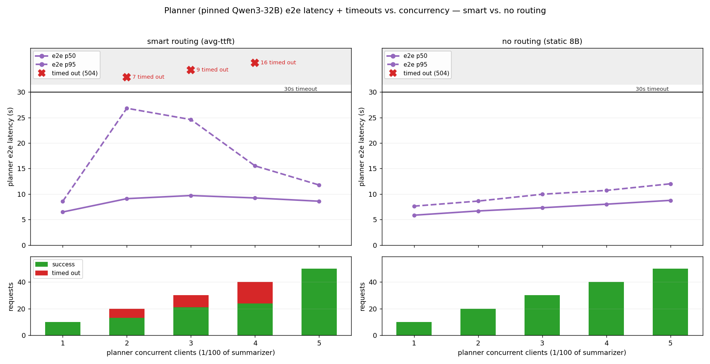
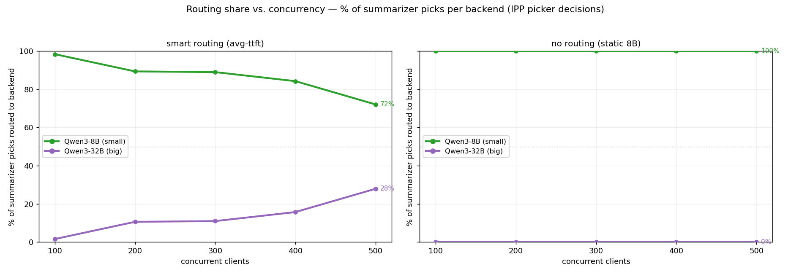
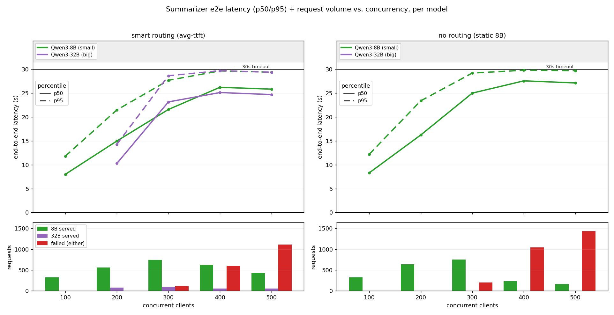

# Deep-research agent — smart routing vs no routing (OCP, pure avg-ttft scorer)

A deep-research agent answers one query by crawling hundreds of pages. The **small model
(Qwen3-8B)** summarizes each fetched page — hundreds of calls, the saturating workload. The
**big model (Qwen3-32B)** runs only the rare plan/synthesis calls and otherwise sits idle.
The IPP **inflight-aware avg-ttft scorer** watches live per-backend TTFT (with a queue-depth
penalty) and, when the 8B saturates, offloads summarization overflow onto the idle 32B.

**Clean A/B, planner running in both arms:**

| | **Arm A — SMART** | **Arm B — NO routing** |
|---|---|---|
| Summarizer `model` | `["Qwen/Qwen3-8B","Qwen/Qwen3-32B"]` → scorer picks | `"Qwen/Qwen3-8B"` → always 8B |
| Planner `model` | `Qwen/Qwen3-32B` (pinned) | `Qwen/Qwen3-32B` (pinned) |
| IPP config | pure `avg-ttft-scorer` + `max-score-picker` | identical (no-op with 1 candidate) |

Both: summarizer ramp C=100/200/300/400/500 (6000 reqs). The **planner is a second inference-perf
harness** in `llm-d-arad-planner` (run-only, `--endpoint-url` the same gateway), ramping
**C=1,2,3,4,5 — exactly 1/100 of the summarizer** — pinned to Qwen3-32B, with `num_requests` sized
so each planner stage spans the matching summarizer stage. The planner is started **first** and the
summarizer launched once the planner is actually sending, so the two stage ramps overlap in
wall-clock time. The only summarizer knob is its `model` field (array vs single) — no IPP change.

## Result — smart routing wins by offloading; the cost is planner contention

| C | SMART succ/fail | goodput tok/s | STATIC succ/fail | goodput tok/s |
|---|---|---|---|---|
| 100 | 400/0 | 3436 | 400/0 | 3138 |
| 200 | 800/0 | 3623 | 799/1 | 3227 |
| 300 | 1080/120 | 3132 | 993/207 | 2462 |
| 400 | 983/617 | **1942** | 471/1129 | **881** |
| 500 | 755/1245 | **1382** | 305/1695 | **569** |
| **total** | **4018 / 1982 (33% fail)** | | **2968 / 3032 (51% fail)** | |

- **+35% more summaries completed** (4018 vs 2968), **33% vs 51% failures**, and **~2.2–2.4×
  goodput** at the C=400/500 ceiling where pinning-to-8B collapses. (A later dual-harness re-run
  with the heavier inference-perf planner — below — pushes the smart arm to 39% fail as the planner
  competes harder for the 32B, but the win holds: 3664 vs 2930 completed.)

## The cost of offloading — the planner pays (inference-perf planner, C=1–5)

The planner ran as its own inference-perf harness (real latency, 150 reqs over C=1–5). The A/B is
stark: **under no routing the planner is pristine** — 0 timeouts at every stage, e2e p95 ≤12s,
because the static summarizer never touches the 32B. **Under smart routing the planner times out** —
**32 of 150 requests (mostly C=2–4) hit the 30s ceiling** and e2e p95 spikes to **26.8s**, because
summarization overflow now floods the 32B the planner needs. Timed-out requests are drawn as red
×-markers in the band above the 30s line (7/9/16 at C=2/3/4), spaced per stage.

| planner C | SMART succ/fail (p95 e2e) | STATIC succ/fail (p95 e2e) |
|---|---|---|
| 1 | 10/0 (8.6s) | 10/0 (7.6s) |
| 2 | 13/7 (26.8s) | 20/0 (8.6s) |
| 3 | 21/9 (24.6s) | 30/0 (10.0s) |
| 4 | 24/16 (15.5s) | 40/0 (10.7s) |
| 5 | 50/0 (11.8s) | 50/0 (12.0s) |

So the headline trade-off is real and now measured on both sides: **smart routing rescues the
summarizer by offloading to the idle 32B, but it degrades the planner that depends on that 32B.**
(Caveat: two independent harnesses don't sync perfectly — the planner's C=5 stage drifted just past
the summarizer's end, so it shows 0 timeouts instead of the worst; C=2–4 capture the contention.)

## The offload rises monotonically with load (the headline)

Smart picker 32B-share climbs **4.3% → 13.1% → 13.4% → 18.1% → 29.9%** as the 8B saturates
(8B drops 98%→72%); static stays flat 100% 8B. This is the **pure inflight-aware avg-ttft
scorer** (`predicted = baseTTFT × (1 + inflightWeight × requests)`, inflightWeight=1.0) —
unlike the earlier avg-ttft+inflight *blend*, the offload curve is clean and monotonic.

## Per-model latency + request volume

Smart (left): the 32B (purple) appears from C=200 and runs with headroom (p50 stays ≤25s,
dips at C=500); the red **failed** bars are visibly shorter than static's. Static (right):
all-8B, failures explode (1129 then 1695 at C=400/500). `latency_vs_concurrency_ab_stacked.png`
is the same with stacked volume bars. Per-model split = served model in each response
(successes only; failures aren't attributed to a model — OCP fails on *either* backend).

## Setup

- **Scorer:** pure `avg-ttft-scorer` + `max-score-picker` (no separate inflight plugin — the
  inflight-awareness is *inside* the avg-ttft scorer). Branch `inflight-aware-scorer` (e550d6d),
  byte-identical avg-ttft to Mohammad-nassar10's `inflight-aware-scorer` tip.
- **IPP image** `ghcr.io/aradhalevy/llm-d-inference-payload-processor:tracechunk` at **`--v=4`**:
  the response-body-chunk log was moved to TRACE so `--v=4` yields `"Model selected"` + scorer
  scores with **no flood** → 100% decision capture from `oc logs`.
- **Capture (Path 1):** two nets — rolling `oc logs --since=20s` every 12s + a long-lived
  `oc logs -f` — unioned and deduped by `x-request-id`. Arm A captured **6173/6173** decisions.
- **Per-arm data:** `arm_a_smart/`, `arm_b_static/` (stage files, `per_request_slim.json` full
  6000 records via in-pod extraction, `ipp-decisions.log`, planner codes, `oc-logs/`); bundles
  `collected-logs-blog-arm_*`. Orchestrator `ipp_benchmarking/tools/ab_blog_run.sh`.

## Gotchas hit (this run)
- **Single-GPU rolling restart deadlocks** and scaling to 0 on the contended cluster **loses the
  H100 to other tenants** — `oc rollout undo` / keep old pods instead.
- The **data-access pod is owned by llmdbenchmark** (label `role=llm-d-benchmark-data-access`); a
  hand-made pod of the same name fails step 02 on immutable fields. Let llmdbenchmark create it.
- The **10Gi `workload-pvc` fills up** from accumulated 1GB `per_request` files → harness gets
  `Disk quota exceeded` and stalls. Clean `/requests/*` between runs (it's exclusive to this ns).
